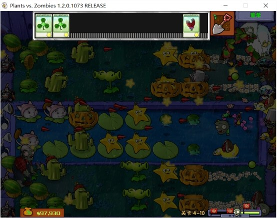

。。
。。。。。
然而并没有看出来日记和普通笔记的区别。。
学园孤岛 终 于 告一段落了。。
由于第10集没有完全下载完成当时，
与之相同情况的还有第03集，
好吧，只好蹭着别人家的wifi，
在B站把第03，10集嘿嘿嘿.....
不说这个，前9集看得我啊咦哦喔诶...
好吧PC和B站的区别就在于后者有各种弹幕而前者没有，
弹幕真是一个好东西~~
当然仅仅只有一集~~
临近终点的时候突然看到一条醒目的提示：
第11集最恐怖。。。。
当时看到这一消息的时候内心顿时并呈耳烛~~
已经不知道要说什么了...
只好又把11集的视频连同弹幕一并缴获，
不知为何，这种时候应该屏蔽掉的，
这种氛围怎么能愉悦地观影呢。。。
总之，接下来并没有理睬那所谓的11集，
而是打开手机热点，
下载安装了PVZ和修改器。。。
（花费了我不少的流量呐~T_T~）
好吧，在修改qi的辅助下，成功地截了一张图：

什么都不说，
为什么看着“学园孤岛”却想着PVZ~~~
醉了~~~
我想还是因为捕捉雪人僵尸吧~~~
不过我想说的是，最后一集。。
呃，还是不说了 直接放几张图片。

总觉得这部番有点像之前的一部，内心早已各种想法喷涌而出...
总之这部上一年的7月番就这样结束咯~
然而我还是一个人。。