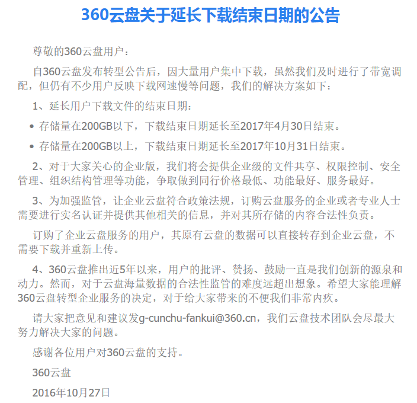

##### 360云盘关于延长下载结束日期的公告

&emsp;&emsp;尊敬的360云盘用户：自360云盘发布转型公告后，因大量用户集中下载，虽然我们及时进行了带宽调配，但仍有不少用户反映下载网速慢等问题，我们的解决方案如下：

 1. 延长用户下载文件的结束日期：
	- 存储量在200GB以下，下载结束日期延长至2017年4月30日结束。
	- 存储量在200GB以上，下载结束日期延长至2017年10月31日结束。
2. 对于大家关心的企业版，我们将会提供企业级的文件共享、权限控制、安全管理、组织结构管理等功能，争取做到同行价格最低、功能最好、服务最好。
3. 为加强监管，让企业云盘符合政策法规，订购云盘服务的企业或者专业人士需要进行实名认证并提供其他相关的信息，并对其所存储的内容合法性负责。 &emsp;&emsp;订购了企业云盘服务的用户，其原有云盘的数据可以直接转存到企业云盘，不需要下载并重新上传。
4. 360云盘推出近5年以来，用户的批评、赞扬、鼓励一直是我们创新的源泉和动力。然而，对于云盘海量数据的合法性监管的难度远超出想象。希望大家能理解360云盘转型企业服务的决定，对于给大家带来的不便我们非常内疚。

&emsp;&emsp;请大家把意见和建议发<g-cunchu-fankui@360.cn>，我们云盘技术团队会尽最大努力解决大家的问题。
&emsp;&emsp;感谢各位用户对360云盘的支持。
&emsp;&emsp;360云盘
&emsp;&emsp;2016年10月27日

